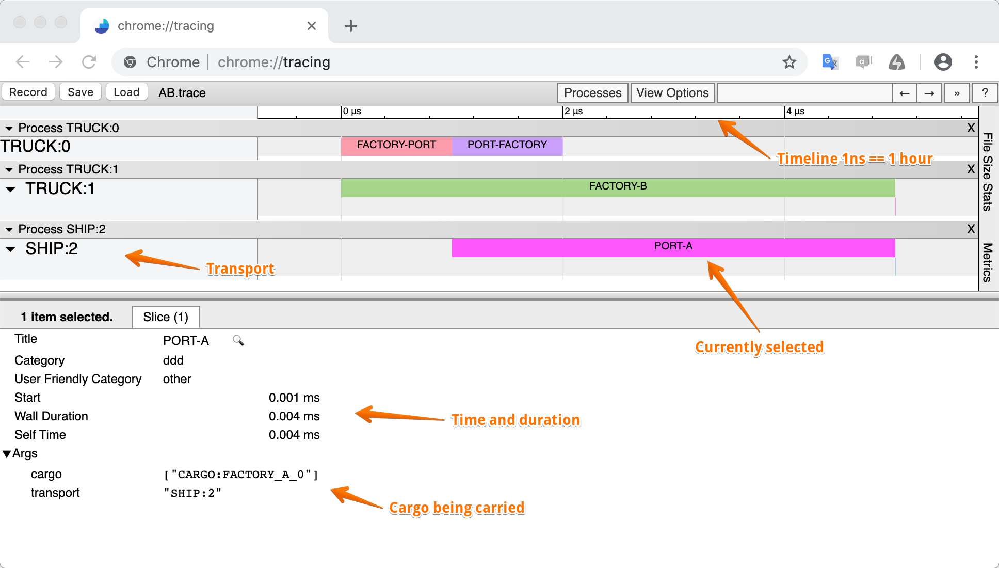
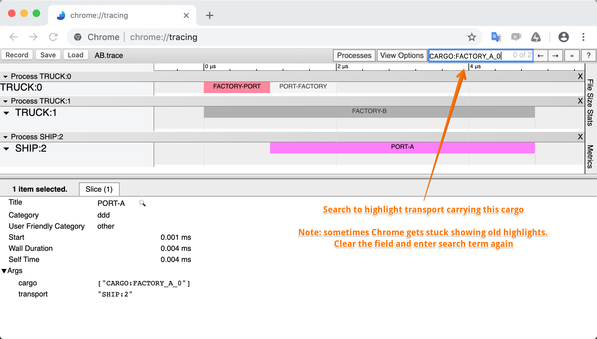
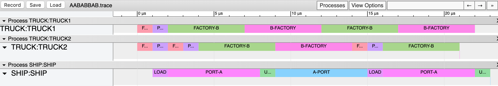
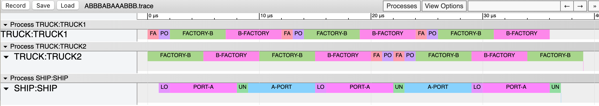

[Back to index](transport-tycoon.md)

# Exercise 2

> There is a [second podcast episode](https://storage.googleapis.com/swp-podcast/ethos/swp-ethos-podcast-02.mp3) in which Peter and Rinat share thoughts about first exercise and move forward to the second one.

We've got more than 15 solutions at the moment of writing. They are in 9 different languages with completely different implementation styles and architectures. The answers to the problems are also different. 

**That diversity is a good thing**, but it makes difficult to compare the results. It is the time to open up the black-boxes without imposing too much constraints on the implementation details.

Let's modify the solution so that it would log important events in the following format:

- Log entries are in JSON, one JSON object per line

- Optional text comments could start with the #, they are ignored.

We need to **log an entry when the important domain events happen: transport departs and when it arrives**. 

A single line in the log might look like the one below. It is pretty-printed to look nice, normally it would be one line:

```textile
{
  "event": "DEPART",     # type of log entry: DEPART or ARRIVE
  "time": 0,             # time in hours
  "transport_id": 0,     # unique transport id
  "kind": "TRUCK",       # transport kind
  "location": "FACTORY", # current location
  "destination": "PORT", # destination (only for DEPART events)
  "cargo": [             # array of cargo being carried
    {
      "cargo_id": 0,     # unique cargo id
      "destination": "A",# where should the cargo be delivered
      "origin": "FACTORY"# where it is originally from
    }
  ]
}
```

Here is an example event log for the entire `AB` delivery:

```textile
# Deliver AB
{"event": "DEPART", "time": 0, "transport_id": 0, "kind": "TRUCK", "location": "FACTORY", "destination": "PORT", "cargo": [{"cargo_id": 0, "destination": "A", "origin": "FACTORY"}]}
{"event": "DEPART", "time": 0, "transport_id": 1, "kind": "TRUCK", "location": "FACTORY", "destination": "B", "cargo": [{"cargo_id": 1, "destination": "B", "origin": "FACTORY"}]}
{"event": "ARRIVE", "time": 1, "transport_id": 0, "kind": "TRUCK", "location": "PORT", "cargo": [{"cargo_id": 0, "destination": "A", "origin": "FACTORY"}]}
{"event": "DEPART", "time": 1, "transport_id": 0, "kind": "TRUCK", "location": "PORT", "destination": "FACTORY"}
{"event": "DEPART", "time": 1, "transport_id": 2, "kind": "SHIP", "location": "PORT", "destination": "A", "cargo": [{"cargo_id": 0, "destination": "A", "origin": "FACTORY"}]}
{"event": "ARRIVE", "time": 2, "transport_id": 0, "kind": "TRUCK", "location": "FACTORY"}
{"event": "ARRIVE", "time": 5, "transport_id": 1, "kind": "TRUCK", "location": "B", "cargo": [{"cargo_id": 1, "destination": "B", "origin": "FACTORY"}]}
{"event": "DEPART", "time": 5, "transport_id": 1, "kind": "TRUCK", "location": "B", "destination": "FACTORY"}
{"event": "ARRIVE", "time": 5, "transport_id": 2, "kind": "SHIP", "location": "A", "cargo": [{"cargo_id": 0, "destination": "A", "origin": "FACTORY"}]}
{"event": "DEPART", "time": 5, "transport_id": 2, "kind": "SHIP", "location": "A", "destination": "PORT"}
```

Given that file, we could do two things with our event logs:

1. Compare the reasoning of our solution to the reasoning from the another solution (even though they could be in different languages).

2. Feed it to the [trace.py](transport-tycoon/trace/) script that will convert this log to Chrome Trace Viewer format file (also JSON, but a different format). That file could be loaded in Chrome to display the outline of our travel.

Here is how the trace for the `AB` delivery might look like:



You can also search for the cargo to highlight the related transport transfers:



Now that we have tools, we could investigate and debug complex flows. The tooling would also make is easier to introduce more intricate domain details to the code.

## Task

- **Extend your solution** to print domain events.

- Run the domain event log through the [trace.py](transport-tycoon/trace/) converter and then **display in the Chrome Trace tool**. Does the `AABABBAB` solution look right? Does it complete on the hour 29? What about `ABBBABAAABBB`?

- Add a new rules to the code:
  
  - **Ship can take up to 4 containers, but is slower now**:
    
    - Ship takes 1 hour to load *all* cargo
    
    - Ship takes 1 hour to unload *all* cargo
    
    - Ship takes 6 hours to travel in each direction
    
    - Note, that ship doesn't wait to be full in order to DEPART. It just LOADs the available cargo and leaves.

- Add `LOAD` and `UNLOAD` events to the domain output. They have similar schema as `ARRIVE`, are published at the beginning of the operation and have  `duration` field (`0` for TRUCK and `1` for the SHIP)

## Reference Traces

We are including reference traces so that you could compare your simulation results.

*AABABBAB* 

_ABBBABAAABBB_



## Exercise Notes

- Feel free to add domain logs and rendered trace files alongside your solution and **point to their folder** in the [solution list](https://github.com/Softwarepark/exercises/blob/master/transport-tycoon/README.md) ("*Ex 2*" column). For example, put domain logs for the `AB` scenario into `AB.log`. Solution list already has some references.
- Check out the [exercise discussions](https://github.com/orgs/ddd-exercises/teams/tt/discussions).

## Next

[Exercise 3](transport-tycoon-3.md) is available!
