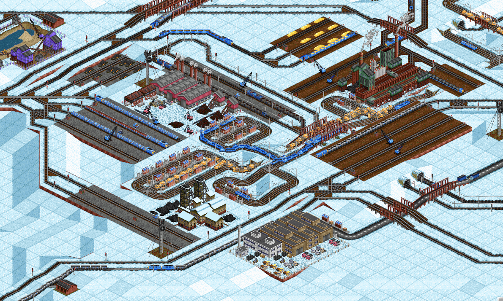

# Transport Tycoon Exercises for DDD

This is a set of Domain-Driven Design (DDD) exercises. They take place in the universe of the [Transport Tycoon](https://en.wikipedia.org/wiki/Transport_Tycoon). It is a game "in which the player acts as an entrepreneur in control of a transport company, and can compete against rival companies to make as much profit as possible by transporting passengers and various goods by road, rail, sea and air."

- [Exercise 1](transport-tycoon-1.md)

- [Exercise 2](transport-tycoon-2.md)

- [Exercise 3](transport-tycoon-3.md) 

- [Exercise solutions](https://github.com/Softwarepark/exercises/blob/master/transport-tycoon/README.md) (feel free to add your solution)

- [Github discussions](https://github.com/orgs/ddd-exercises/teams/tt/discussions) (add your solution to get access OR just request via issues)

You can subscribe to the [newsletter for the updates](https://tinyletter.com/softwarepark) or just check this repository later.

> Screenshot is from the [OpenTTD showcase](https://www.openttd.org/screenshots.html) (an open source simulation game based upon Transport Tycoon Deluxe).
