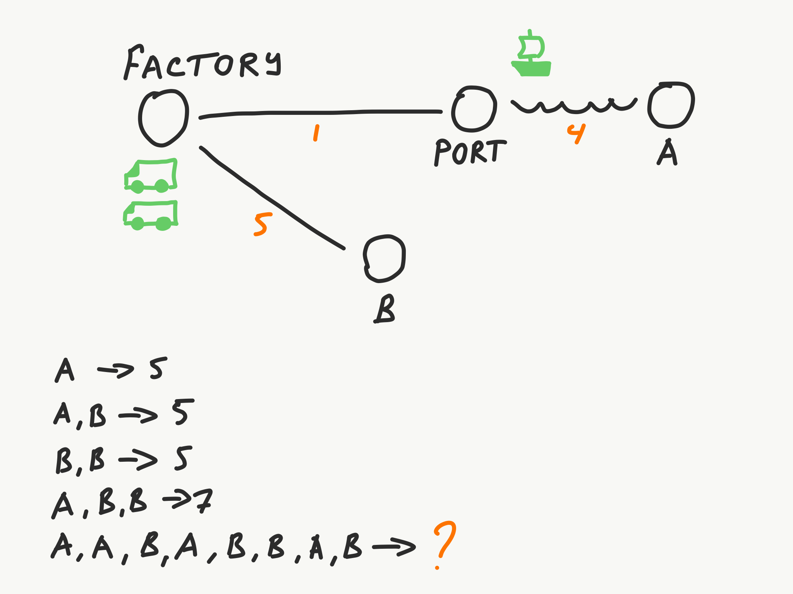

# Transport Tycoon Exercises for DDD

This is a set of DDD/ES exercises takes place in the universe of the [Transport Tycoon](https://en.wikipedia.org/wiki/Transport_Tycoon). It is a game "in which the player acts as an entrepreneur in control of a transport company, and can compete against rival companies to make as much profit as possible by transporting passengers and various goods by road, rail, sea and air."

> Screenshot is from the [OpenTTD showcase](https://www.openttd.org/screenshots.html) (an open source simulation game based upon Transport Tycoon Deluxe).

## Exercise 1

> You can listen to [10-minute introduction by Peter Szarvas and Rinat Abdullin](https://storage.googleapis.com/swp-podcast/ethos/swp-ethos-podcast-01.mp3) or read the summary below.

There is a map containing a Factory, Port, warehouse A and B. Factory has a small stock of containers that have to be delivered to these warehouses. There are **two trucks and one ship that can carry one container at a time** (trucks start at Factory, ship starts at the Port). 

**Traveling takes a specific amount of hours** (represented by an orange number). Time is needed to travel in one direction, you also spend the same amount of time to come back. For example, it takes 5 hours for a truck to travel from the Factory to B.

Transport follows a simple heuristic: pick the first available container from the location, bring it to the designation, then come back home. Truck that drops off cargo at the Port doesn't need to wait for the ship (there is a small warehouse buffer there). It can drop the cargo and start heading back.

Transport moves *in parallel*. First truck might be bringing container to a location A, while the second truck comes back from A, while ship travels back to the Port.

**Task**: write a program that takes a list of cargos from the command line and prints out the number of hours that it would take to get them delivered.

| Input        | Output |
| ------------ | ------ |
| A            | 5      |
| AB           | 5      |
| BB           | 5      |
| ABB          | 7      |
| AABABBAB     | ?      |
| ABBBABAAABBB | ?      |

When done, feel free to add your solution to the [transport-tycoon](transport-tycoon/) folder (you might need to clone the repository and send a Pull Request). Put the code into the subfolder named the same as your github alias.

## Exercise 2

To be announced November 13-15.
