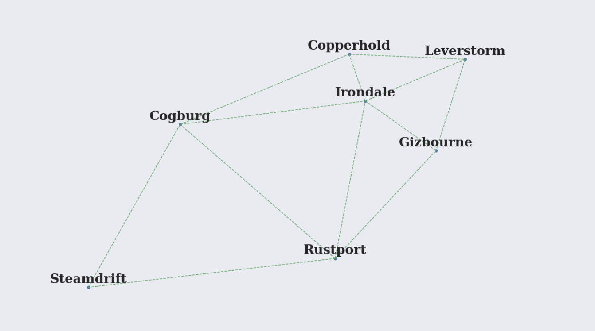

[Back to index](transport-tycoon.md) 

# Episode 2.1 - Find shortest path on map

In the previous season of DDD katas we were working with a static route. Trucks and ferries were travelling along the predefined route.  

**Now it is the time to make things more realistic.** Transports normally aren't bound to a route and are free to find their own route on a map. Routing algorithm is the heart of any transport-based system, be it Transport Tycoon or Google ETA. 

Take a look at this map (exact distances are provided below). How can a truck find the shortest route between any two cities? 



## Task

Write a short code that can take names of two cities and print out the shortest path between them. For example: 

```
$ route Steamdrift Leverstorm
Steamdrift,Cogburg,Irondale,Leverstorm
```

Here is the CSV [map with the distances](transport-tycoon/s02e01_map.csv). Or in plain text:

```
A           	B           	km
Cogburg     	Copperhold  	1047
Leverstorm  	Irondale    	673
Cogburg     	Steamdrift  	1269
Copperhold  	Irondale    	345
Copperhold  	Leverstorm  	569
Leverstorm  	Gizbourne   	866
Rustport    	Cogburg     	1421
Rustport    	Steamdrift  	1947
Rustport    	Gizbourne   	1220
Irondale    	Gizbourne   	526
Cogburg     	Irondale    	1034
Rustport    	Irondale    	1302
```


## Next

- We maintain [a list of all solutions](transport-tycoon/README.md). Please feel free to submit a pull request adding your solution as well!
- If you have any questions or comments - we have a [Discord chat](https://discord.gg/jHGbUwxDgv).
- Next episode will be published within 2 weeks. You can watch this repository or [subscribe to the mailing list](https://tinyletter.com/softwarepark).
- 🔜 Episode 2.2: Mine historical data for travel speed
