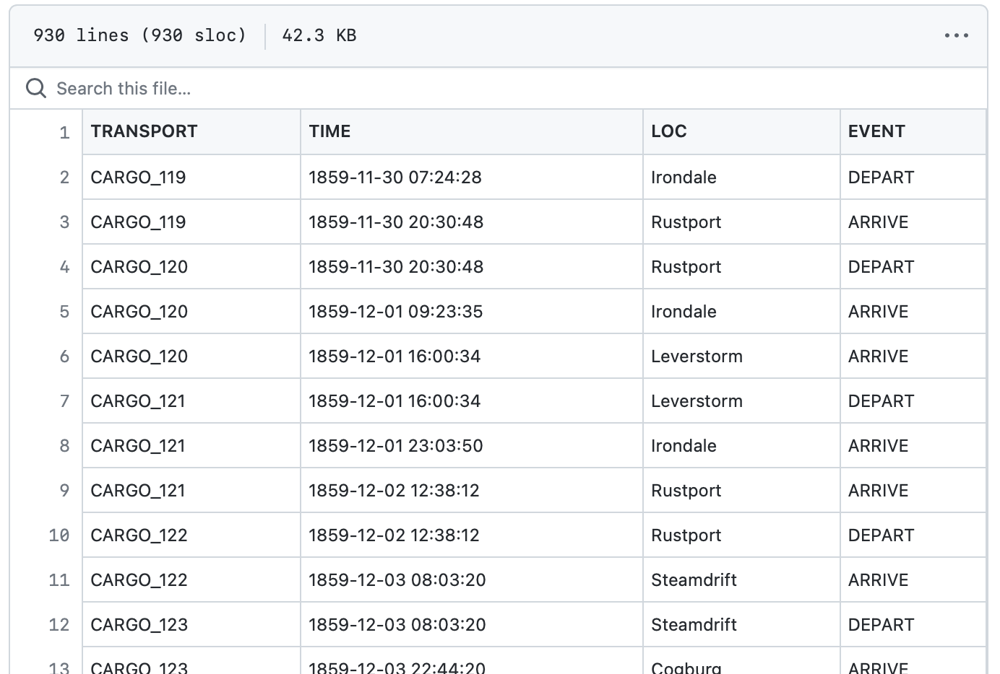
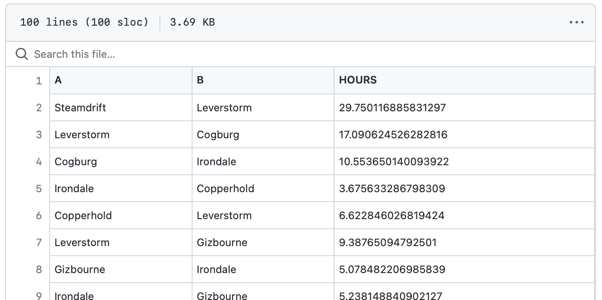

Previous: [Compute ETA with fixed speed](transport-tycoon_22.md) | [Index](transport-tycoon.md) 

# Episode 2.3: Mine historical data for travel speed

In the previous exercise we computed Estimated Time of Arrival (ETA) for a cargo truck. 

The truck moved between two locations with a **predefined speed**. We wrote a script that loaded the travel speed for each road from a file and computed fastest travel route between any two locations:

```bash
> route Steamdrift Leverstorm
 0.00h  DEPART  Steamdrift
14.26h  ARRIVE  Cogburg
24.81h  ARRIVE  Irondale
31.88h  ARRIVE  Leverstorm
```

In this exercise, we will no longer rely on predefined speed values. Instead, we *mine* probable speeds from historical travel data or, put in another way, we will **train a model** for predicting speeds of future travels. To **validate the model**, we will use the standard approach: we will hide some observations (trips) when training the model, then predict speeds for these previously ignored trips, and check how accurate our prediction was. We will count **absolute difference** between the real (but yet hidden) speed  and predicted speeds: we say that the smaller is the difference (averaged over all such hidden trips), the higher is the model quality. 

## Training

We have a training dataset [s02e03_train.csv](transport-tycoon/s02e03_train.csv). It is a CSV file with the travel history. It looks similar to the output from the previous exercise:



This file is a travel log of a company that runs multiple trucks. Whenever there is a delivery from A to B:

- New row is added with a unique `transport_id`, timestamp, starting location and `DEPART` event
- One row is added for each intermediate and final milestone with `ARRIVE` event.

We can mine that file to construct a history of travel times between every two locations: 

- load each trip from the file (uniquely identified by value in `TRANSPORT` column);
- each trip will have one or more segments, represented by `DEPART` event and one or more `ARRIVE` events;
- for each road segment we can compute observed travel time by substracting arrival time from the departure: `travel_time = arrival_time - departure_time`.

For example:

```
# CARGO-999
DEPART Leverstorm at December 03, 16:00
ARRIVE Irondale at December 03, 23:03
ARRIVE Rustport at December 04, 12:07
```

From this we infer the trip durations:

- `Leverstorm` to `Irondale` took 23:03 - 16:00 = 07:03 hours
- `Irondale` to `Rustport` happened overnight from December 03 23:03 to Dec 04 12:07. It took 13:04 minutes (time difference between these timestamps)

We estimate the road travel time as the average duration of all known past trips on this road. Known trips are called *observations*, or *samples*, and we write `travel_time = sum(travel_time_samples) / len(travel_time_samples)`. We do this for each road, and combine with the model from the previous exercise - now we can *predict* travel time between any two locations (even if there are no direct trips between them in our historical data!)

Here are our steps to build the model:

1. Load travel history from [s02e03_train.csv](transport-tycoon/s02e03_train.csv).
2. Convert timestamps into travel duration times for each road.
3. For each road, compute average travel time. 
4. Use average travel times in the model from the previous exercise.

A new model is now trained to predict travel times using insights from the travel history.

## Validation

Now, how do we know if our predictions make any sense? We need to validate our findings. For convenience, we have already "hidden" some travel times, and make them available in a separate dataset: [s02e03_test.csv](transport-tycoon/s02e03_test.csv). 

This CSV files contains real (or *observed*) travel times (in hours) between two locations (ATA stands for `Actual Time of Arrival`).

 

We validate our model by going through each row in this validation dataset and making a prediction for it. We then take the absolute difference (*error*) between predicted time of arriveal (ata) and the real timestamp  in the `ATA` column in the table below.

```
PREDICTED TRAVEL TIME | ACTUAL TRAVEL TIME | ERROR      | NOTE
16:23:01              | 16:24:59           | ~2 minutes | This is quite good!
20:44:12              | 12:42:22           | ~8 hours   | The model is WAY off here
```
Smaller the difference between these numbers (or *error*)- more accurate the model is.

In order to communicate model accuracy the others, we would need to somehow **aggregate all errors into a single model error**. 

Averaging over errors wouldn't work here. Imagine you have two travel results:

```
PREDICTED TRAVEL TIME | ACTUAL TRAVEL TIME | ERROR      |
1 hour                | 2 hours            | 1 hour     |
2 hours               | 1 hour             | -1 hour    |
```

If we average these two errors we would get `0` - which is the perfect score, while the error is huge, about as big as the actual trip duration!
We can avoid this pitfall by considering error values without the signs (it does not matter if our prediction is smaller or bigger than the actual value: the absolute error is the same in both cases). In statistics, it is typical to use the *square* of the error instead of the absolute value, and to average the squared errors of all predictions in the test set. This metric is known as *Mean Squared Error* (MSE):


The above formula can be computed using the following Python code:

```python
error_sum = 0
for loc_a, loc_b, actual_hours in test_dataset:
  preducted_hours = predict(loc_a, loc_b)
  difference = actual_hours - predicted_hours
  square = difference * difference
  error_sum += square
mse = error_sum / len(test_dataset)
print(f"Mean squared error is {mse}")
```

To reiterate:

1. For each row in [s02e03_test.csv](transport-tycoon/s02e03_test.csv) use the trained model to predict travel time.
2. For each row compute error by computing difference between the observed travel time (from the file) and predicted travel time (from the model).
3. Aggregate these errors into a single error number by using the Mean Squared Error formula.

## Task

Write a console application that:

- uses thte training dataset `s02e03_train.csv` to compute average travel times for each road;
- predicts travel times in hours for each row in the validation dataset `s02e03_test.csv`;
- computes Mean Squared Error for these predictions and prints the result.

For example:

```
> python3 solution_s0203.py
MSE is 0.37877778702
```

The number above is just a sample. Your number will be slightly different :)

## Next

- Contribute your solution to [a list of all solutions](transport-tycoon/README.md)! Linked page explains how to do that.
- If you have any questions or comments - we have a [Discord chat](https://discord.gg/jHGbUwxDgv).
- Next episode will be published within 2 weeks. You can watch this repository or [subscribe to the mailing list](https://tinyletter.com/softwarepark).
- 🔜 Episode 2.4: Setup training pipeline and iterate

