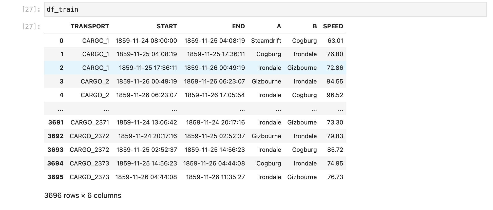
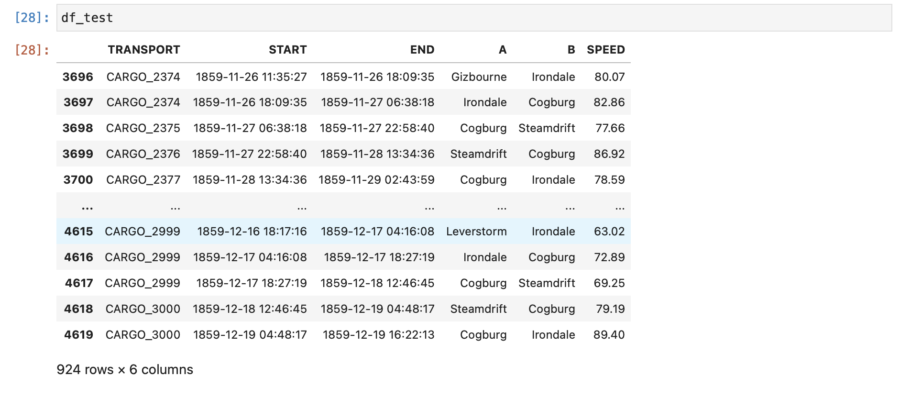

Back to [list of exercises](transport-tycoon.md).

# Episode 2.4: Connect speed model to the simulation

In previous exercises we have done two things:

- Created a code to find a fastest route between any two locations (Started in 2.1 and finished in 2.2). This model used predefined travel speeds.
- Created a model to mine historical data and estimate speed for each road (Done in 2.3).

Now it is the time to plug these two together in a iterative loop.

> This is a kind of work that ML Operations Engineer would be doing in a team.


## Task

Write a pipeline that runs these two steps in one iteration:

1. Train the model from the historical data (as was done in 2.3)
2. Use test data to run the simulation end-to-end using the model and compute the final MSE

While computing MSE for the whole simulation, we don't care if the simulation uses different route than what was observed. We are interested only in the arrival times to the final destination: estimated time of arrival (ETA) vs actual time of arrival (ATA).

Given the input file, we should be able to train the model and then test the entire simulation in one go.

```bash
> train_model s02e04_train.csv
Saved to model.json

> run_simulation model.json s02e04_test.csv
Simulation MSE is 9999.999

```

Files:

- train data -  [s02e04_train.csv](transport-tycoon/s02e04_train.csv)
- test data - [s02e04_test.csv](transport-tycoon/s02e04_test.csv)


To make things easier, we've added `START` time and `END` time for each leg in a trip.



Also for the test data:



## Next

- Contribute your solution to [a list of all solutions](transport-tycoon/README.md)! Linked page explains how to do that.
- If you have any questions or comments - we have a [Discord chat](https://discord.gg/jHGbUwxDgv).
- Next episode will be published within 2 weeks. You can watch this repository or [subscribe to the mailing list](https://tinyletter.com/softwarepark).
- 🔜 Episode 2.5: Setting up confusion matrix